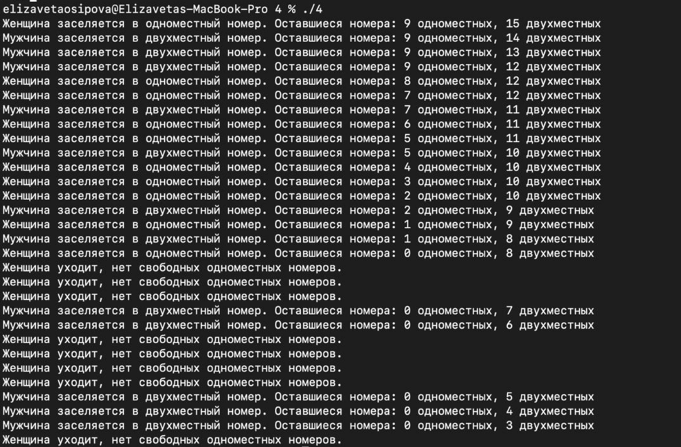
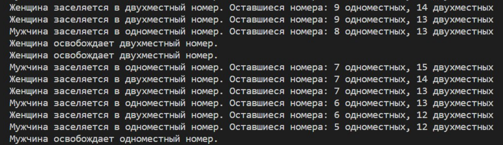
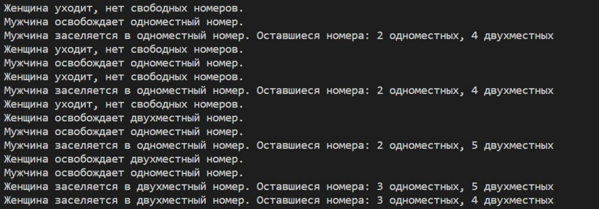

## Домашнее задание №2.

Применение семафоров для организации взаимодействия параллельных процессов.

### **Осипова Елизавета Владимировна - БПИ-219**.

### **Вариант №14.  **

Цели и задачи: Изучить работу с потоками. Научиться разбивать задачу на части, для последующего их выполнения различными
потоками.

#### Задача о гостинице – 3 (дамы и джентльмены).

В гостинице 10 номеров рассчитаны на одного человека и 15 номеров рассчитаны на двух человек. В гостиницу случайно
приходят клиенты–дамы и клиенты–джентльмены, и конечно они могут провести ночь в номере только с представителем своего
пола. Если для клиента не находится подходящего номера, он уходит искать ночлег в другое место. Клиенты порождаются
динамически и уничтожаются при освобождении номера или уходе из гостиницы при невозможности поселиться. Создать
приложение, моделирующее работу гостиницы. Каждого клиента реализовать в виде отдельного процесса.

## 4 балла

[4.c](4%2F4.c) - множество процессов взаимодействуют с использованием именованных POSIX семафоров. Обмен данными ведется через разделяемую память в стандарте POSIX.

Данный код реализует многопроцессную программу на языке C, которая демонстрирует работу с POSIX-семафорами и разделяемой памятью в операционной системе Linux.

Программа моделирует работу отеля, в котором есть 10 одноместных номеров и 15 двухместных номеров. Каждый процесс-клиент представляет собой поток выполнения, который взаимодействует с остальными потоками, используя семафоры. Обмен данными между процессами осуществляется через разделяемую память.

Для работы с разделяемой памятью используется функция mmap, которая отображает область разделяемой памяти на адресное пространство процесса. Для работы с семафорами используется функция sem_open, которая создает или открывает существующий POSIX-семафор с заданным именем.

В функции customer реализована логика клиента отеля, который может быть мужчиной или женщиной. Каждый клиент пытается заселиться в одноместный или двухместный номер, используя семафоры sem_single и sem_double. Если номер свободен, клиент заселяется в него и проводит в нем некоторое время, после чего освобождает номер.

Функция signal_handler служит для обработки сигнала SIGINT, который посылается процессу при нажатии комбинации клавиш Ctrl+C. При получении сигнала программа завершает свою работу и освобождает все ресурсы.

Функции init_shared_memory и destroy_shared_memory инициализируют и освобождают разделяемую память, соответственно. Функции init_semaphores и destroy_semaphores инициализируют и освобождают семафоры, соответственно.

Функция main создает заданное количество клиентов (процессов) и запускает их работу. Каждый клиент работает в бесконечном цикле, пытаясь заселиться в номер и освободить его. Когда программа получает сигнал SIGINT, она завершает работу и освобождает все ресурсы.

## 5 баллов

[5.c](5%2F5.c) - множество процессов взаимодействуют с использованием неименованных POSIX семафоров расположенных в разделяемой памяти. Обмен данными также ведется через разделяемую память в стандарте POSIX.

Данный код на языке программирования С реализует симуляцию работы гостиницы с помощью многопроцессного взаимодействия и семафоров, которые расположены в разделяемой памяти. Обмен данными между процессами также происходит через разделяемую память.

Перед началом работы программы инициализируются семафоры и разделяемая память с помощью функций sem_init() и shm_open(), соответственно. После завершения работы программы необходимо освободить ресурсы, вызвав функции sem_destroy() и shm_unlink().

В основной функции main() запускается определенное количество процессов, представляющих гостей гостиницы. Каждый гость может быть мужчиной или женщиной и пытается заселиться в одноместный или двухместный номер. После заселения гость проводит некоторое время в номере, а затем освобождает его.

Для реализации симуляции работы гостиницы используются семафоры sem_t, которые позволяют ограничивать количество доступных номеров для заселения. Кроме того, используется семафор-мьютекс sem_mutex, который защищает доступ к общей памяти и позволяет избежать гонок данных.

Функции, связанные с разделяемой памятью в стандарте POSIX, определены в заголовочном файле <sys/mman.h> и включают в себя shm_open(), shm_unlink(), mmap() и munmap(). Чтобы использовать разделяемую память, процессы должны создать именованный объект разделяемой памяти с помощью функции shm_open(), а затем отобразить его в адресное пространство процесса с помощью функции mmap(). Когда процесс закончил использование разделяемой памяти, он должен освободить ее с помощью функции munmap() и удалить объект разделяемой памяти с помощью функции shm_unlink().

## 6 баллов

[6.c](6%2F6.c) - Множество процессов взаимодействуют с использованием семафоров в стандарте UNIX SYSTEM V. Обмен данными ведется через разделяемую память в стандарте UNIX SYSTEM V.

В этом коде применение семафоров реализовано для взаимодействия между несколькими процессами.

Семафоры используются для управления доступом к разделяемым ресурсам, в данном случае - к общей структуре hotel_status, которая хранится в разделяемой памяти. Структура содержит информацию о состоянии гостиницы, такой как количество свободных одноместных и двухместных номеров, а также количество постояльцев в этих номерах.

В коде создаются три семафора, которые используются для управления доступом к одноместным номерам, двухместным номерам и к самой структуре hotel_status. Функции sem_wait и sem_post используются для блокировки и разблокировки семафоров, а функция sem_trywait используется для попытки блокировки семафора без ожидания.

Обмен данными в этом коде осуществляется через разделяемую память в стандарте UNIX SYSTEM V. Функции shmget и shmat используются для создания и подключения к разделяемой памяти, а функция shmctl используется для удаления разделяемой памяти после ее использования.

## 7 баллов

Этот код реализует программу, состоящую из отдельных процессов, запускаемых независимо друг от друга. В коде представлены три разных файла: первый (client - [client.c](7%2Fclient.c)) представляет собой код для процесса клиента, второй (main - [main.c](7%2Fmain.c)) представляет собой код для процесса-координатора, и третий (server - [server.c](7%2Fserver.c)) представляет собой код для процесса сервера.

Используя семафоры и разделяемую память, между ними организовано взаимодействие. В коде используются именованные POSIX семафоры для синхронизации доступа к разделяемой памяти между процессами. Обмен данными осуществляется через разделяемую память, которая также реализована с использованием стандарта POSIX.

В качестве разделяемой памяти используется структура hotel_status, которая хранит информацию о количестве одноместных и двухместных номеров, а также о количестве заселенных мужчин и женщин. В процессе клиента (client) реализована логика, с помощью которой мужчины и женщины занимают и освобождают номера, а семафоры используются для контроля доступа к разделяемой памяти. В процессе сервера (server) инициализируется разделяемая память и семафоры. В процессе-координаторе (main) создаются дочерние процессы для сервера и клиентов, и ожидается завершение работы.

## 8 баллов

В коде представлены три программы: инициализация гостиницы, клиенты гостиницы и главная программа, которая создает клиентов и контролирует их выполнение. Эти программы взаимодействуют между собой с использованием семафоров и разделяемой памяти, как указано в задаче.

Семафоры используются для ограничения доступа к разделяемой памяти, представляющей состояние гостиницы, а также для контроля доступности одноместных и двухместных номеров. Разделяемая память используется для хранения информации о количестве свободных и занятых номеров в гостинице. Семафоры и разделяемая память организованы с использованием стандарта UNIX System V.

## 9 баллов

Этот код реализует приложение, состоящее из отдельных программ-процессов, запускаемых независимо друг от друга. Взаимодействие между процессами организовано с использованием семафоров и разделяемой памяти.

В коде присутствует две отдельные программы: сервер и клиенты. Сервер представляет собой отель с ограниченным количеством одноместных и двухместных номеров. Клиенты представляют собой мужчин и женщин, которые пытаются заселиться в номера отеля.

Для синхронизации доступа к общим ресурсам (количество свободных одноместных и двухместных номеров) используются именованные POSIX семафоры. В частности, используются три семафора:

sem_single - семафор для одноместных номеров.
sem_double - семафор для двухместных номеров.
sem_mutex - семафор для обеспечения взаимоисключения при доступе к разделяемой памяти.
Разделяемая память используется для хранения информации о состоянии отеля (количество свободных и занятых одноместных и двухместных номеров). Взаимодействие между процессами происходит через эту разделяемую память, а не через каналы или очереди сообщений.

Результаты работы: 

